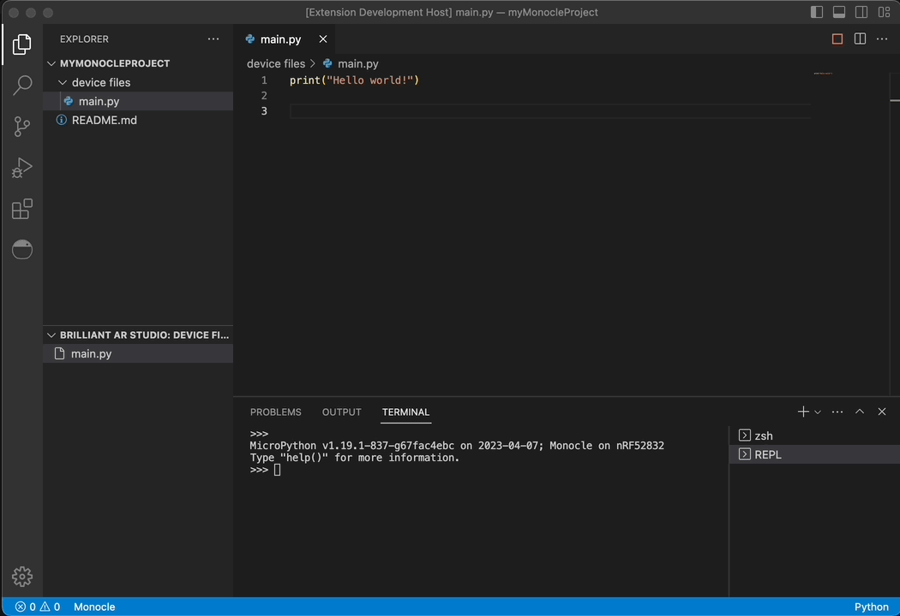
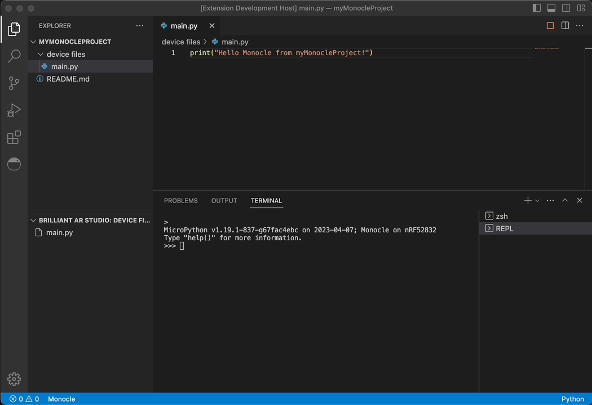
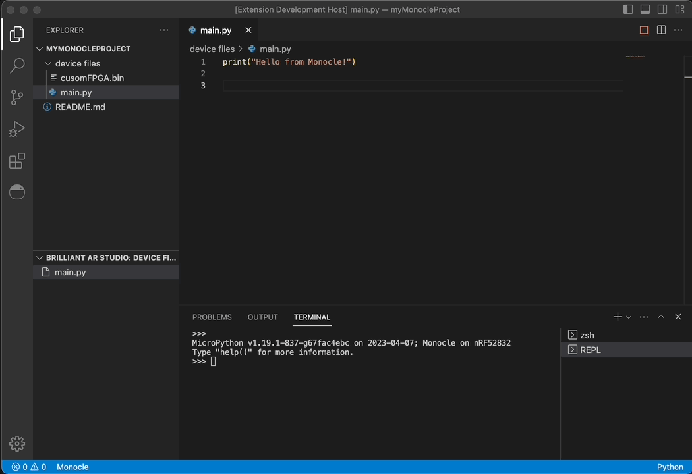
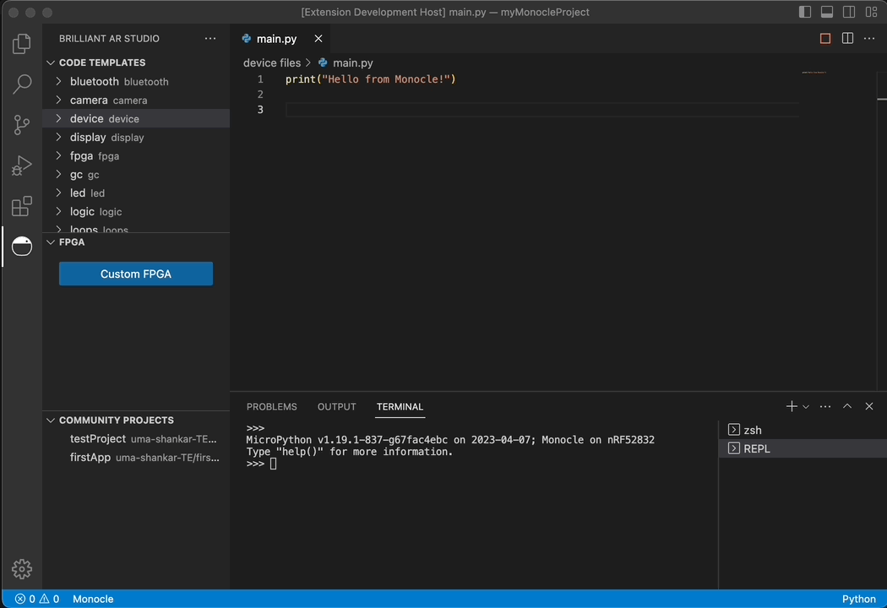
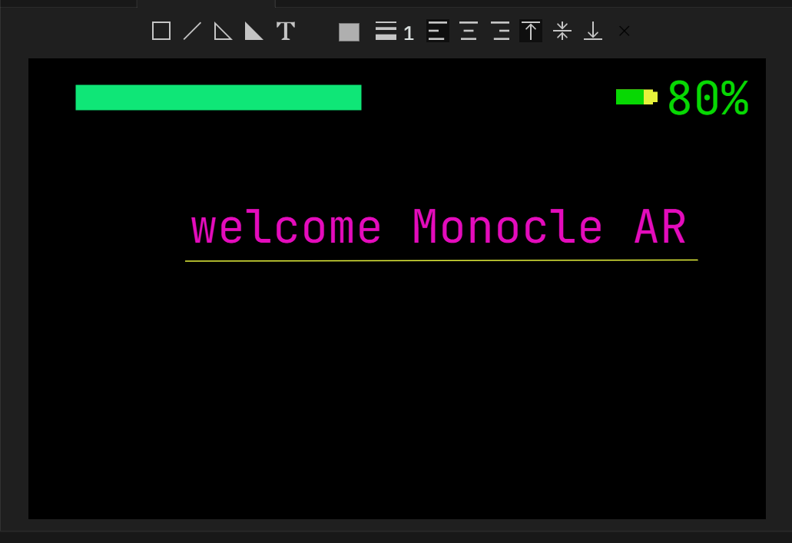

# Brilliant AR Studio

Build and test your Monocle AR apps with ease using MicroPython! 🐍

Check out the full documentation the [docs pages 📚](https://docs.brilliant.xyz), or [contribute 🧑‍💻](https://github.com/brilliantlabsAR/ar-studio-for-vscode) to make this extension even better!

## Features

Loading and saving Python files to your device:

Access the on-device REPL:

Easily browse the various MicroPython modules:

Update your FPGA binaries:

Browse community projects, or publish your own:

### UI instructions

1. Make sure a project is initialized (you can see 'device files' in File Explorer)
   if not setup, do with command 'Brilliant AR Studio: Brilliant AR Studio: Initialize new project folder'
   choose project name and directory and you are good to go.

2. connect monocle from one of the ways
   a. command 'Brilliant AR Studio: Connect'
   b. status bar button 'monocle'
   c. file explorer -> Brilliant AR Studio: device files -> connect

3. after connect you can see REPL and all files listed in file explorer -> Brilliant AR Studio: device files

4. Now open main.py and edit and after save it will be uploaded to Device.
   you can create any file or directory and it will be transferred to device
   make sure all file remains in 'device files'. you can also upload files/dir from 'device files' dir by
   right click and 'Brilliant AR Studio: Upload File To Device'

5. Auto run: it means as soon as you save all files will be transferred and main.py will run. default is always on you turn off by button at right corner of editor or command 'Brilliant AR Studio: Stop auto run'.
   to start again click on play button at right corner of editor or 'Brilliant AR Studio: start auto run'

6. Run in Device: with this all file will be transferred and excuted at REPL run time
   quite useful to test files without uploading.
   use with button at at right corner of editor or 'Brilliant AR Studio: Run in Device'

Create and Edit display screens with DRAG-DROP UI:

### DRAG DROP instructions

1. Start a new screen with Brilliant AR Studio -> screens -> click on plus icon
   or with command 'Brilliant AR Studio: Open New GUI Screen'

2. Two columns of editor will appear one for python code and other the GUI. dont change python code

3. Draw from GUI with and after every change python file will change
   and you can test with Run in Device button or command

4. Drawing instrctions and shorcuts:
   1. To draw Rectangle select recatangle and drag and then click to select, transform or move
   2. To draw Line select Line and click on two points then click to select or drag a selection , adjust anchors
   3. To draw Polyline or polygon click select button and click multiple points and to finish double click or  
      to cancel press Esc. to adjust select and move anchor points
   4. To write text select T and drag to make box, double click to edit and enter or outside click to finish.
      shift + enter to new line
   5. you can move any object with arrow keys after select. ctrl + arrow keys to move with precise
   6. to delete select and press delete button, multiple selected objects can be deleted
   7. ctrl + A to select all
   8. ctrl + D to duplicate selected

## Requirements

- Windows or MacOS
- Bluetooth hardware correctly installed on your system.

## Known Issues

- Bluetooth not yet working on Linux.
